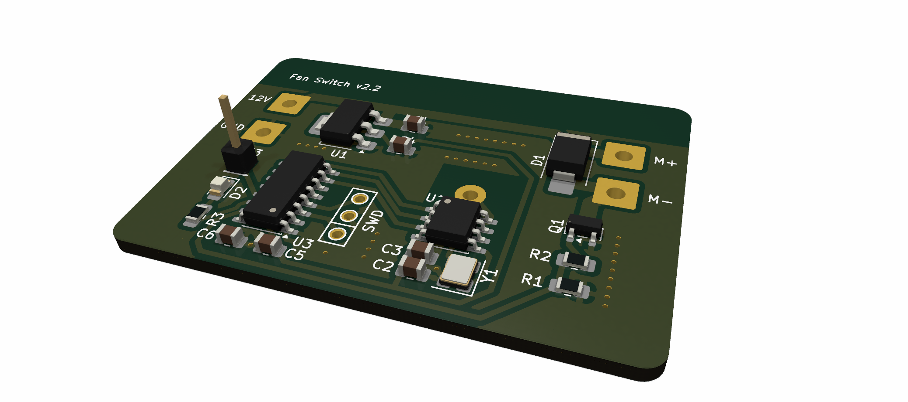

# hw-fan-switch

A small, wirelessly-controlled 12 V DC fan switch. It drives a fan with a
variable PWM duty cycle and is controlled over a BLE long-range radio link,
making it part of the [Bleriot](https://github.com/burgrp/bleriot) node network.



The board is built around a **Puya PY32F003** Cortex-M0+ microcontroller with a
**PAN211x** radio, and the firmware is written in Go and compiled with
[TinyGo](https://tinygo.org/).

## Features

- Variable-speed fan control via hardware PWM (TIM14_CH1 on `PB1`).
- 50 kHz PWM carrier, above the audible range to avoid switching noise.
- Configurable low-speed handling:
  - **Low-duty threshold** — below this duty the fan is treated as stopped and
    the output is forced to 0.
  - **Low-duty kickstart** — a brief higher-duty pulse to overcome fan stiction
    when starting at low speed.
- Wireless control and telemetry over the PAN211x BLE long-range link.
- Persistent per-device provisioning (address, key, channel and config) stored
  in the MCU's configuration flash page.

## Repository layout

| Path | Description |
| --- | --- |
| `board/` | KiCad hardware design (schematic, PCB, BOM, production files). |
| `fw/` | TinyGo firmware and the host-side CLI (provisioning, hub). |
| `fw/spec/` | Device specification: registers and the provisioning `Config`. |
| `sub/hw-kicad/` | Shared KiCad symbol/footprint library (git submodule). |

## Hardware

| Function | Pin |
| --- | --- |
| Status LED | `PB0` |
| Fan PWM output (TIM14_CH1, AF0) | `PB1` |
| Radio SPI clock | `PA2` |
| Radio SPI data | `PA1` |
| Radio SPI chip select | `PA4` |

The KiCad project lives in `board/`, with fabrication outputs (Gerbers, BOM,
positions) under `board/production/`.

## Firmware

The firmware is a flat `package main` selected by build tags: the `tinygo` build
(`main.go`) is the on-device application, while the `!tinygo` build
(`test-hub.go`) provides a host-side test hub. Hardware targets are chosen via
the TinyGo `--target` and build tags rather than separate directories.

### Prerequisites

- [TinyGo](https://tinygo.org/getting-started/install/)
- [pyOCD](https://pyocd.io/) for flashing and RTT logging
- `arm-none-eabi-objdump` (optional, for disassembly)

Clone with submodules:

```sh
git clone --recurse-submodules https://github.com/burgrp/hw-fan-switch.git
```

### Build & flash

All commands run from the `fw/` directory.

```sh
# One-time: install the CMSIS pack for the target
make install-pack

# Build the firmware image (image.elf)
make build

# Flash the device and stream RTT logs
make flash

# Stream RTT logs from a running device
make rtt
```

### Provisioning

Each device is provisioned with an identity (address, key, channel) and its
`Config` (default duty and low-duty parameters), which is written to the MCU's
configuration flash page.

```sh
# Create a new device identity
make new

# Write the provisioning page to the connected device
make provision

# Run the control hub
make hub
```

## Configuration

The provisioning `Config` (see `fw/spec/spec.go`) controls runtime behaviour:

| Field | Meaning |
| --- | --- |
| `DefaultDuty` | Fan duty cycle (0–100) applied at startup. |
| `LowDutyThreshold` | Duty below which the fan is forced to 0. `0` disables the threshold. |
| `LowDutyKickstart` | Duty briefly applied to spin up the fan from low speed. `0` disables the kickstart. |

## Control interface

The device exposes a single register over the Bleriot network:

| Register | Tag | Type | Unit | Description |
| --- | --- | --- | --- | --- |
| `duty` | 1 | int | % | PWM duty cycle, 0–100. |

Writing `duty` updates the fan speed and notifies the network; reading it returns
the current duty.
