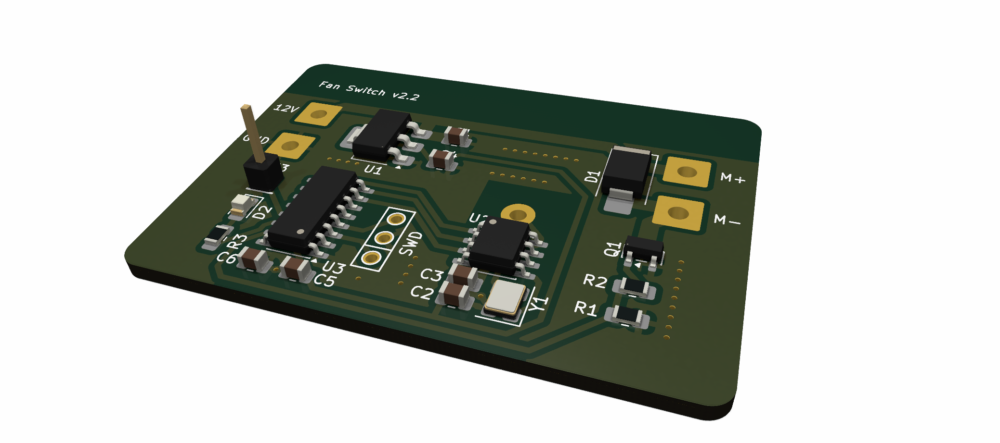

# hw-fan-switch

A small, wirelessly-controlled 12 V DC fan switch. It drives a fan with a
variable PWM duty cycle and is controlled over a BLE long-range radio link,
making it part of the [Bleriot](https://github.com/burgrp/bleriot) node network.



The board is built around a **Puya PY32F003** Cortex-M0+ microcontroller with a
**PAN211x** radio, and the firmware is written in Go and compiled with
[TinyGo](https://tinygo.org/).

## Features

- Variable-speed fan control via hardware PWM (TIM14_CH1 on `PB1`).
- 50 kHz PWM carrier, above the audible range to avoid switching noise.
- Configurable low-speed handling:
  - **Low-duty threshold** — below this duty the fan is treated as stopped and
    the output is forced to 0.
  - **Low-duty kickstart** — a brief higher-duty pulse to overcome fan stiction
    when starting at low speed.
- Wireless control and telemetry over the PAN211x BLE long-range link.
- Device identity, radio settings, and configuration are owned by the site
  inventory and baked into each firmware image at build time.

## Repository layout

| Path | Description |
| --- | --- |
| `board/` | KiCad hardware design (schematic, PCB, BOM, production files). |
| `fw/` | TinyGo firmware and a host-side test inventory. |
| `fw/spec/` | Device specification: registers and runtime `Config`. |
| `sub/hw-kicad/` | Shared KiCad symbol/footprint library (git submodule). |

## Hardware

| Function | Pin |
| --- | --- |
| Status LED | `PB0` |
| Fan PWM output (TIM14_CH1, AF0) | `PB1` |
| Radio SPI clock | `PA2` |
| Radio SPI data | `PA1` |
| Radio SPI chip select | `PA4` |

The KiCad project lives in `board/`, with fabrication outputs (Gerbers, BOM,
positions) under `board/production/`.

## Firmware

The firmware is a flat `package main` selected by build tags: the `tinygo` build
(`main.go`) is the on-device application, while the `!tinygo` build
(`test-hub.go`) provides a host-side test hub. Hardware targets are chosen via
the TinyGo `--target` and build tags rather than separate directories.
`fw/main_gen.go` is generated from the inventory and gitignored; it contains
the `main` function that supplies the baked identity and configuration to the
firmware application.

### Prerequisites

- [TinyGo](https://tinygo.org/getting-started/install/)
- [pyOCD](https://pyocd.io/) for flashing and RTT logging
- `arm-none-eabi-objdump` (optional, for disassembly)

Clone with submodules:

```sh
git clone --recurse-submodules https://github.com/burgrp/hw-fan-switch.git
```

### Build and flash

Build deployment firmware from the authoritative site inventory. For the AGC
checkout and its `basement.fan` instance:

```sh
cd /home/paul/git/agc/bleriot

# Inspect the generated entry point without writing it
go run . gen basement.fan

# One-time: install the target CMSIS pack
go run . make --root /home/paul/git/hw-fan-switch/fw basement.fan install-pack

# Generate main_gen.go and build image.elf
go run . make --root /home/paul/git/hw-fan-switch/fw basement.fan build

# Generate, build, flash, and open RTT
go run . make --root /home/paul/git/hw-fan-switch/fw basement.fan flash

# Open RTT without flashing
go run . make --root /home/paul/git/hw-fan-switch/fw basement.fan rtt
```

The `bleriot make` command resolves the selected inventory instance, writes its
identity and `Config` to `fw/main_gen.go`, injects the chip's TinyGo and pyOCD
targets, then delegates to the firmware Makefile. The generated file is local
build state and must not be committed.

## Configuration

The inventory `Config` (see `fw/spec/spec.go`) controls runtime behaviour:

| Field | Meaning |
| --- | --- |
| `DefaultDuty` | Fan duty cycle (0–100) applied at startup. |
| `LowDutyThreshold` | Duty below which the fan is forced to 0. `0` disables the threshold. |
| `LowDutyKickstart` | Duty briefly applied to spin up the fan from low speed. `0` disables the kickstart. |

## Control interface

The device exposes a single register over the Bleriot network:

| Register | Tag | Type | Unit | Description |
| --- | --- | --- | --- | --- |
| `duty` | 1 | int | % | PWM duty cycle, 0–100. |

Writing `duty` updates the fan speed and notifies the network; reading it returns
the current duty.
